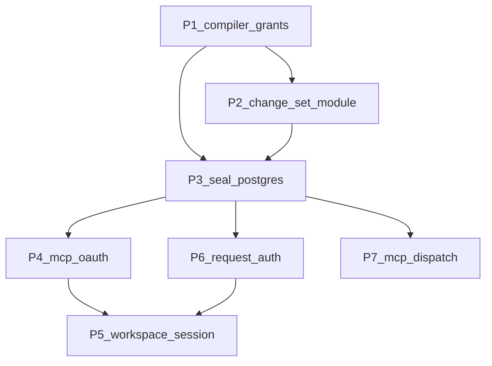

# Architecture Deepening — Full Sequence Plan

> **For agentic workers:** Implement one phase per PR. Do not mix phases. Before coding a phase, re-read the deletion test and ADR notes for that phase. Use acceptance tests on real Postgres as the primary verification surface.

**Goal:** Turn shallow, leaky modules into deep ones — more behaviour behind smaller interfaces — so grants, change sets, and console/MCP adapters have locality and one testable seam each.

**Source:** Architecture review (`/tmp/architecture-review-1788891408.html`, 2026-09-08). Vocabulary: **module**, **interface**, **implementation**, **depth**, **seam**, **adapter**, **leverage**, **locality** (`agent/skills/codebase-design/SKILL.md`).

**Scope:** Full review sequence — Strong → Worth exploring → Speculative — as seven phases.

**Out of scope:** Reopening ADR-001–004 storage/product decisions; document-first storage; jsonb EAV; CloudFront/site redesign; new product features unrelated to deepening.

---

## Current state (facts)

Already in good shape (do **not** shallow-split):

| Module | Why leave alone |
|--------|-----------------|
| `compileQuery` / `compileReadRecord` | Grants + masks + predicates + joins + aggregates + page ACL in SQL |
| `searchCollections` / `listRelatedRecords` | Already call `compilePageAccessPredicate` in SQL (no engine post-filter) |
| `generateCollectionDdl` | ADR-002 real DDL + RLS backstop |
| `applyChangeSet` algorithm | ADR-003 heart — relocate for locality, never fragment |
| `BlobStore` / `Embedder` | Real seams (local + remote adapters) |
| GraphQL DataLoader → `engine.query` | Correct adapter |

Still shallow / leaking:

| Friction | Evidence |
|----------|----------|
| Dual page-ACL implementations | `compiler/page-access-sql.ts` vs `org/page-access.ts` `canViewPage` |
| `assertRowAccessible` | Row predicate only — no page ACL |
| `readRecord` | Compiler path then redundant `canViewPage` post-check |
| Wiki-links / graph route | N× `canViewPage` / `filterVisibleRecordIds` |
| Change-set listing | SQL in `apps/app/.../review/route.ts` and `packages/cli/src/review.ts` |
| Public `ownerPool` | Console, CLI, provisioning, MCP OAuth, billing helpers |
| MCP OAuth | Runtime DDL + protocol split across Next routes |
| Console session | Six+ `fetch('/api/schema')` sites |
| Request auth | `requireWorkspace` vs `resolveRequestAuth` vs inline WorkOS |
| MCP dispatch | `schemas` + `handlers` + `invoke` name the same tools thrice |

---

## Global constraints

- **ADR-001–004 stay accepted.** Relational-first, schema-per-workspace, pending-op change sets, pgvector in-DB.
- **ADR-005 repair is Phase 1.** Predicate injection primary; RLS remains cheap backstop only. Do not move grant logic into RLS.
- **Single authorization path through the query compiler** for every data-plane read (system design §5.2 / §7).
- **Predicate exclusions return not-found, never forbidden** (PRD §8).
- **No `SELECT *`.** Compiled predicates only. Field masks on aggregates.
- **Acceptance tests on real Postgres** remain the gate; do not replace with oracle-only coverage.
- **One phase = one PR.** Prefer `cursor/architecture-deepening-pN-a439`.
- **Do not propose new interfaces in this plan beyond the phase sketches below.** When a phase starts, grill interface shape before coding if the seam is unclear.

---

## Dependency graph

P1 first (security). P2 and P3 can overlap after P1 lands, but P3 is cleaner after P2 adds `listChangeSetSummaries` (removes the biggest `ownerPool` SQL consumers). P4–P7 sit on the sealed seam.

---

## Phase 1 — Query compiler as the only grant path

**Strength:** Strong · **Category:** in-process · **ADR:** repairs ADR-005 spirit

### Problem

Page visibility is encoded twice (`compilePageAccessPredicate` and `canViewPage`). Propose-time `assertRowAccessible` ignores page ACL. Wiki-links and the graph route still post-filter. `readRecord` double-checks after the compiler already injected page ACL.

### Deepening

One page-ACL **rule table** (or shared helper) that both the SQL compiler and the single-row evaluator derive from. Every data-plane path that needs “may this principal see this row?” goes through compiler-produced SQL *or* that shared evaluator — never a third copy.

### Tasks

- [ ] Extract shared page-ACL rule helpers used by both `compilePageAccessPredicate` and `canViewPage` (same effective principals, workspace/owner/admin/shared semantics). Prefer one module under `packages/core/src/compiler/` or `packages/core/src/org/` that owns the rules; SQL and imperative check are adapters of it.
- [ ] Extend `assertRowAccessible` in [`packages/core/src/engine.ts`](packages/core/src/engine.ts) to inject `compilePageAccessPredicate` (or call a shared “authorized row exists” helper). Missing page ⇒ `not_found`.
- [ ] Remove redundant `canViewPage` after successful `compileReadRecord` in `readRecord` once property tests prove equivalence — or keep a debug assert behind a flag and delete in the same PR once green.
- [ ] Rewrite wiki-link edge listing in [`packages/core/src/links/wiki-links.ts`](packages/core/src/links/wiki-links.ts) to compile page ACL into SQL (pattern from `listRelatedRecords`); delete N× `canViewPage` loops for list paths.
- [ ] Slim [`apps/app/src/app/api/graph/route.ts`](apps/app/src/app/api/graph/route.ts): stop belt-and-braces `filterVisibleRecordIds` once `listRelated` / wiki edges are compiler-correct; route becomes a thin adapter.
- [ ] Add acceptance cases: private page excluded from propose target, wiki backlinks, and graph neighbors; assert `not_found` not `forbidden`. Extend [`packages/acceptance/src/search-graph.test.ts`](packages/acceptance/src/search-graph.test.ts) or sibling.

### Done when

- One rule source for page ACL; `canViewPage(id) === compileQuery(filter id).length === 1` covered by tests.
- No data-plane list path relies on post-filter as the primary grant mechanism.
- CI authorization matrix covers query / search / related / propose-row / wiki.

### Do not

- Move row predicates into RLS.
- Invent a second “AuthZ service” package outside the compiler.

---

## Phase 2 — Change-set module + `listSummaries`

**Strength:** Strong · **Category:** in-process · **ADR:** ADR-003 locality (not reopen)

### Problem

Propose / review / apply live inside the 5k-line `engine.ts`. Listing (what Changes shows) is shallow SQL in the console and CLI. Policy matchers are unit-tested; call sites are not the test surface.

### Deepening

A deep change-set module owning propose → review → apply → list summaries. `KitsuneEngine` remains the composition root / facade. Console and CLI become adapters of `listChangeSetSummaries`.

### Tasks

- [ ] Create `packages/core/src/changeset/` (or similar): move propose / review / apply / expire / feedback helpers out of `engine.ts` without changing external method names on `KitsuneEngine` in this phase (thin delegates).
- [ ] Add `listChangeSetSummaries({ workspaceId, principalId, scope, authorId })` returning the DTO today’s [`apps/app/src/app/api/review/route.ts`](apps/app/src/app/api/review/route.ts) builds (ops, conflict fields, author, page grouping via existing `group-ops-by-page` logic server-side).
- [ ] Replace SQL in `review/route.ts` and [`packages/cli/src/review.ts`](packages/cli/src/review.ts) with the engine method.
- [ ] Keep apply algorithm intact (lock order, author-grant recheck, field conflicts, revision writes, post-apply hooks as internal ports).
- [ ] Acceptance: list open / closed / by-author matches prior console behaviour; apply conflict cases still pass.

### Done when

- Deleting the console/CLI listing SQL does not move table knowledge out of core.
- Changes / sidebar badge / onboarding / CLI review all call one interface.

### Do not

- Split apply into microscopic files.
- Change op granularity or atomic unit (PRD §8).

---

## Phase 3 — Seal the Postgres seam

**Strength:** Strong · **Category:** ports & adapters

### Problem

System design §7: “none talk to Postgres directly.” `KitsuneEngine.ownerPool` / `appPool` are public; apps learn `kitsune.*` table names. `withAppTransaction` exists unused while BEGIN/SET LOCAL/audit are hand-rolled.

### Deepening

Engine interface is the only seam to control-plane and data-plane SQL. Pools become internal. Missing operations become methods. Session+audit uses one helper.

### Tasks

- [ ] Add engine methods for remaining pool consumers: page access get/share/upsert, grants bundle (principals + collections + grants), API-key resolve (if not already), plan-limit checks used by server, membership claim paths used by `require-workspace`, MCP OAuth table ops (or leave those for Phase 4 behind a dedicated module that still does not export pools).
- [ ] Mark pools non-public (package-internal / `@internal` / stop exporting from class public fields). Update [`packages/core/src/index.ts`](packages/core/src/index.ts) barrel so pool-taking helpers are not the preferred console interface.
- [ ] Refactor engine hot paths to `withAppTransaction` for session context + rollback locality.
- [ ] Fix call sites: provisioning, server MCP handlers, acceptance fixtures — prefer engine methods; acceptance may keep owner SQL for oracle/setup only where unavoidable, documented.
- [ ] Grep gate: no `engine.ownerPool` outside `packages/core` (and allowlisted test helpers).

### Done when

- `rg 'ownerPool' apps packages/cli packages/server packages/mcp packages/provisioning` is empty (or allowlist is explicit and tiny).
- New console routes cannot SQL without an engine method.

### Do not

- Introduce an in-memory fake for the full data plane; keep real Postgres / local-substitutable.

---

## Phase 4 — MCP OAuth as one module

**Strength:** Worth exploring · **Category:** ports & adapters

### Problem

Hottest recent surface. HMAC/PKCE/runtime DDL live in [`apps/app/src/lib/mcp-oauth.ts`](apps/app/src/lib/mcp-oauth.ts); register/authorize/token routes hold SQL; well-known metadata is duplicated; Connect page embeds protocol.

### Deepening

One MCP OAuth module (prefer [`packages/server`](packages/server) next to Streamable HTTP): `registerClient`, `authorize`, `exchangeCode`, `metadata()`, `resolveCredential`. DDL in migrations. Next routes and well-known are thin adapters. Connect consumes a guide DTO.

### Tasks

- [ ] Move tables into [`packages/core/src/db/migration.ts`](packages/core/src/db/migration.ts); delete `ensureMcpOAuthTables` runtime CREATE.
- [ ] Implement module with injectable clock/secret (two adapters: prod HMAC+Postgres, test fixture).
- [ ] Collapse well-known handlers to call `metadata()`.
- [ ] Slim authorize/token/register routes to parse HTTP + call module + AuthKit redirect only.
- [ ] Add `GET /api/connect` (or extend `/api/me`) returning typed connect guides; strip RFC prose builders from [`settings/connect/page.tsx`](apps/app/src/app/(workspace)/settings/connect/page.tsx).
- [ ] Separate Kitsune-as-DB OAuth apps UI from MCP Connect (different OAuth systems).
- [ ] Package tests: PKCE, code replay, redirect mismatch, token expiry — without Next.

### Done when

- OAuth protocol tests pass in `packages/server` (or core) without App Router.
- Connect page has no hardcoded discovery JSON.

### Do not

- Merge MCP AS with `org/oauth-apps` client-credentials — different products, keep separate modules.

---

## Phase 5 — Console workspace session

**Strength:** Worth exploring · **Category:** in-process (presentation)

### Problem

Sidebar, home, collection-view, page-view, onboarding, command palette each `fetch('/api/schema')`. `loadRelationOptions` is duplicated. Shell context carries crumbs, not schema.

### Deepening

One client `WorkspaceSession` module: load me + schema + open change-set count once; invalidate on workspace-changed events. UI uses selectors.

### Tasks

- [ ] Add provider/module under `apps/app/src/lib/` or `components/shell/` with selectors: `schema`, `me`, `openChangeSetCount`, `relationOptions(collection)`.
- [ ] Replace parallel `useEffect(fetch)` in sidebar, home, collection-view, page-view, onboarding, command-palette.
- [ ] Delete duplicate `loadRelationOptions`.
- [ ] Invalidate on existing `WORKSPACE_CHANGED_EVENT` (and after schema mutate / grant changes).
- [ ] Provider tests with mocked fetch.

### Done when

- Only the session module calls `/api/schema` for boot/nav.
- New views do not add a seventh fetcher.

### Do not

- Reimplement grants in the browser. Session is a cache/adapter over HTTP, not a second compiler.

---

## Phase 6 — One RequestAuth interface

**Strength:** Worth exploring · **Category:** mock (WorkOS behind AuthPort)

### Problem

`requireWorkspace` dynamically imports AuthKit; `resolveRequestAuth` layers bearer then session; routes pick inconsistently; checkout calls `withAuth` twice; Unauthorized mapped by string match in many routes.

### Deepening

`RequestAuth` is the only console HTTP auth interface. Inject `AuthPort` (WorkOS prod, header/fixture test). Pair with a small `apiHandler` / `jsonError` adapter so pass-through routes shrink.

### Tasks

- [ ] Define AuthPort + RequestAuth resolution (session | API key | MCP OAuth token) in one module.
- [ ] Refactor `require-workspace` / `request-auth` / billing checkout to use it; no AuthKit imports in route files.
- [ ] Standardize every `/api/*` route on one auth entry + `jsonError`.
- [ ] Convert pure pass-through routes (schema, query, history, related) to one-line adapters where safe.
- [ ] Unit tests with fake AuthPort for membership pick, invite claim, unauthorized.

### Done when

- Grep shows no `withAuth` inside `app/api/**/route.ts`.
- Session-only vs bearer behaviour is documented once and tested.

### Do not

- Bypass engine grants via auth shortcuts.

---

## Phase 7 — Collapse MCP dispatch tables

**Strength:** Speculative · **Category:** ports & adapters

### Problem

`schemas.ts` + `handlers.ts` + `invoke.ts` list the same tool names. Pass-through tools are fine adapters; the triple stack is not. Policy (`memory_remember` propose ceiling, `define_collection` auto-admin grant) hides in handlers.

### Deepening

One MCP adapter: schema registry → engine method. Lift non-pass-through policy into core (change-set / grant modules) so MCP is not the only place the rule exists.

### Tasks

- [ ] Single registry mapping tool name → schema + invoke target.
- [ ] Delete duplicate switch in `invoke.ts` / thin `handlers.ts`.
- [ ] Move `memory_remember` / `define_collection` policy into core methods or named policy helpers tested without MCP.
- [ ] Keep transport (`create-server`, Streamable HTTP) separate.

### Done when

- Adding a pass-through tool touches one registry entry.
- Propose-ceiling for memory tools is enforceable from engine tests.

### Do not

- Add a second authorization path inside MCP.

---

## Suggested PR sequence

| PR | Branch suffix | Phase |
|----|---------------|-------|
| 1 | `p1-compiler-grants` | Phase 1 |
| 2 | `p2-changeset-module` | Phase 2 |
| 3 | `p3-seal-postgres` | Phase 3 |
| 4 | `p4-mcp-oauth` | Phase 4 |
| 5 | `p5-workspace-session` | Phase 5 |
| 6 | `p6-request-auth` | Phase 6 |
| 7 | `p7-mcp-dispatch` | Phase 7 |

Branch template: `cursor/architecture-deepening-<suffix>-a439`.

---

## Testing strategy (every phase)

- Run targeted acceptance packages touched by the phase (`pnpm` filter `@kitsuneos/acceptance` or suite subset).
- For grant/ACL phases: principal matrix (admin, write human, propose agent, revoked, private page share).
- For console phases: manual smoke of Changes, Connect, sidebar nav after automated tests.
- No new oracle that reimplements the compiler; prefer asserting SQL-backed outcomes.

---

## Risks

| Risk | Mitigation |
|------|------------|
| Unifying page ACL drifts visibility | Property tests: evaluator ≡ compiled `EXISTS` for private/shared/workspace/admin |
| Extracting change sets breaks apply | Move code with delegates first; behaviour PR before cleanup PR if needed |
| Sealing pools breaks provisioning/CD | Do Phase 3 after P2; keep allowlisted test SQL documented |
| MCP OAuth migration drops in-flight codes | Migrate DDL first; keep HMAC secret env unchanged |
| Large PRs stall review | One phase per PR; no drive-by refactors |

---

## Top recommendation (start here)

**Phase 1 — query compiler as the only grant path.** Isolation has no acceptable failure rate. Every later surface (graph, share, wiki, propose) is safer once this seam holds.

When ready to implement a phase, start with Phase 1 and grill only the open interface decisions for that phase (shared rule module location, whether `canViewPage` remains public).
