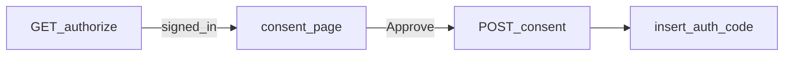

# Product Gaps Implementation Plan

> **For agentic workers:** REQUIRED SUB-SKILL: Use `superpowers:subagent-driven-development` (recommended) or `superpowers:executing-plans` to implement this plan task-by-task. Steps use checkbox (`- [ ]`) syntax for tracking.

**Goal:** Close remaining product-gap UX in sequence: Connect honesty → MCP OAuth consent UI → vault import/export MVP → compiler ACL leftovers (engine) → onboarding copy alignment with S1.

**Architecture:** Keep a single grant/query-compiler authz path. MCP OAuth consent becomes an explicit HTML/React page before code issuance (authorize route redirects to consent, consent POSTs to issue). Vault UI wraps existing `engine.ingest` + CLI semantics behind a Settings/Connect panel. Compiler ACL finishes SQL predicates for graph/related/search so private rows are never materialized.

**Tech Stack:** Next.js App Router (`apps/app`), Postgres control-plane tables (`mcp_oauth_*`, `page_access`), `@kitsuneos/core` engine/compiler, existing CLI ingest, `node:test`.

## Global Constraints

- DNA: field-level change ops; single compiler authz; agents as principals; empty provision (no CRM seed).
- Predicate exclusions return **not-found**, never forbidden.
- Connect must not claim a consent prompt until Task 2 ships; after Task 2, copy must match Approve/Deny.
- Visual tokens follow S2 / existing operate helpers.
- Spec: `docs/superpowers/specs/2026-09-08-product-gaps-design.md`.
- Sequence: A → B → C; E parallel with A; D engine track can parallelize after A.

## File map

| File | Responsibility |
|------|----------------|
| `apps/app/src/lib/connect-copy.ts` | **New** — Connect guide strings + honesty helpers |
| `apps/app/src/lib/connect-copy.test.ts` | **New** — bans false consent language until flag true |
| `apps/app/src/app/(workspace)/settings/connect/page.tsx` | Consume connect-copy |
| `apps/app/src/app/(workspace)/settings/oauth/consent/page.tsx` | **New** — Approve/Deny UI |
| `apps/app/src/app/api/mcp/oauth/authorize/route.ts` | Redirect to consent instead of auto-issuing |
| `apps/app/src/app/api/mcp/oauth/consent/route.ts` | **New** — POST approve/deny |
| `apps/app/src/lib/mcp-oauth.ts` | Shared helpers for pending consent / issue code |
| `apps/app/src/components/settings/vault-panel.tsx` | **New** — import/export UI |
| `apps/app/src/app/api/vault/import/route.ts` | **New** — multipart/zip → ingest |
| `apps/app/src/app/api/vault/export/route.ts` | **New** — markdown export |
| `packages/core/src/compiler/page-access-sql.ts` | Already exists; extend callers |
| `packages/core/src/engine.ts` | Remove related-neighbor post-filter TODO |
| `apps/app/src/app/api/graph/route.ts` | Compiler-level visibility |
| `apps/app/src/app/(workspace)/page.tsx` | Onboarding copy alignment |



---

### Task 1: Connect honesty (Gap A)

**Files:**
- Create: `apps/app/src/lib/connect-copy.ts`
- Create: `apps/app/src/lib/connect-copy.test.ts`
- Modify: `apps/app/src/app/(workspace)/settings/connect/page.tsx`

**Interfaces:**
- Produces: `export const MCP_CONSENT_UI_SHIPPED = false` (flip to `true` in Task 2)
- Produces: `cursorRemoteSteps(): string[]`, `claudeConnectorSteps(): string[]` that never say “Approve when prompted” while flag is false

- [ ] **Step 1: Write failing tests**

```ts
import assert from 'node:assert/strict';
import { describe, it } from 'node:test';
import {
  MCP_CONSENT_UI_SHIPPED,
  allConnectGuideSteps,
} from './connect-copy.ts';

describe('connect copy honesty', () => {
  it('does not promise a consent prompt while consent UI is unshipped', () => {
    if (MCP_CONSENT_UI_SHIPPED) return;
    for (const step of allConnectGuideSteps()) {
      assert.equal(
        /approve access|oauth consent when prompted|when prompted/i.test(step),
        false,
        step,
      );
    }
  });

  it('states sign-in grants access when consent UI is unshipped', () => {
    if (MCP_CONSENT_UI_SHIPPED) return;
    const blob = allConnectGuideSteps().join('\n');
    assert.match(blob, /sign in|signed in|login/i);
  });
});
```

- [ ] **Step 2: Run test (expect fail)**

Run: `pnpm exec node --test apps/app/src/lib/connect-copy.test.ts`

- [ ] **Step 3: Implement `connect-copy.ts` and wire connect page**

Replace hard-coded guide step arrays in `connect/page.tsx` with imports from `connect-copy.ts`. Example steps while unshipped:

```ts
export const MCP_CONSENT_UI_SHIPPED = false;

export function cursorRemoteSteps(): string[] {
  if (MCP_CONSENT_UI_SHIPPED) {
    return [
      'Add the KitsuneOS MCP URL in Cursor.',
      'Sign in, then Approve access for your workspace on the consent screen.',
      'Return to Cursor when the connector finishes.',
    ];
  }
  return [
    'Add the KitsuneOS MCP URL in Cursor.',
    'Sign in to KitsuneOS when redirected. Signing in grants MCP access for your active workspace (there is no separate Approve screen yet).',
    'Return to Cursor when the connector finishes.',
  ];
}

export function allConnectGuideSteps(): string[] {
  return [...cursorRemoteSteps(), ...claudeConnectorSteps()];
}
```

Implement `claudeConnectorSteps()` with the same honesty rule. Keep “Legacy REST ≠ MCP” warning text.

- [ ] **Step 4: Tests pass + commit**

```bash
pnpm exec node --test apps/app/src/lib/connect-copy.test.ts
git add apps/app/src/lib/connect-copy.ts apps/app/src/lib/connect-copy.test.ts apps/app/src/app/\(workspace\)/settings/connect/page.tsx
git commit -m "fix(app): honest Connect MCP copy before consent UI ships"
```

---

### Task 2: MCP OAuth consent UI (Gap B)

**Files:**
- Create: `apps/app/src/app/(workspace)/settings/oauth/consent/page.tsx` (or `/oauth/consent` outside settings if middleware requires — prefer a dedicated route under app that requireWorkspace can protect: `apps/app/src/app/oauth/mcp/consent/page.tsx`)
- Create: `apps/app/src/app/api/mcp/oauth/consent/route.ts`
- Modify: `apps/app/src/app/api/mcp/oauth/authorize/route.ts`
- Modify: `apps/app/src/lib/mcp-oauth.ts`
- Modify: `apps/app/src/lib/connect-copy.ts` (`MCP_CONSENT_UI_SHIPPED = true`)

**Interfaces:**
- Consumes: existing `mcp_oauth_clients`, `newAuthCode`, `requireWorkspace`
- Produces: pending consent row or signed pending payload; `POST /api/mcp/oauth/consent` with `{ decision: 'approve' | 'deny', pendingId: string }`

- [ ] **Step 1: Stop auto-issuing codes in authorize GET**

After validating client + workspace (existing logic through redirect_uri check), **do not** INSERT into `mcp_oauth_codes` yet. Instead:

1. Insert a short-lived pending consent row (new table `kitsune.mcp_oauth_pending` via `ensureMcpOAuthTables`, or reuse a signed cookie/JWT if you must YAGNI-table — prefer table for audit):
   - `id`, `client_id`, `workspace_id`, `principal_id`, `redirect_uri`, `code_challenge`, `code_challenge_method`, `scope`, `state`, `expires_at`
2. Redirect browser to `/oauth/mcp/consent?pending=<id>`

- [ ] **Step 2: Consent page UI**

Show:
- Client name from `mcp_oauth_clients.client_name`
- Active workspace name/id
- Scope (`mcp:tools`)
- Buttons: **Approve** / **Deny**

Approve → `POST /api/mcp/oauth/consent` `{ decision: 'approve', pendingId }`  
Deny → same with `deny`

- [ ] **Step 3: Consent API**

On approve: perform the INSERT currently in authorize route (issue code), delete pending, redirect to `redirect_uri` with `code` + `state`.  
On deny: delete pending, redirect to `redirect_uri` with `error=access_denied` + `state`.  
Expired pending → `400` / error redirect.

- [ ] **Step 4: Flip honesty flag**

Set `MCP_CONSENT_UI_SHIPPED = true` and update step strings to mention Approve. Adjust test so when flag is true, consent language is required:

```ts
it('mentions Approve when consent UI is shipped', () => {
  if (!MCP_CONSENT_UI_SHIPPED) return;
  const blob = allConnectGuideSteps().join('\n');
  assert.match(blob, /Approve/i);
});
```

- [ ] **Step 5: Manual / acceptance**

With a registered MCP client, hit authorize → see consent → Deny → no code in DB; Approve → token exchange works.

- [ ] **Step 6: Commit**

```bash
git add apps/app/src/app/api/mcp/oauth apps/app/src/app/oauth apps/app/src/lib/mcp-oauth.ts apps/app/src/lib/connect-copy.ts apps/app/src/lib/connect-copy.test.ts
git commit -m "feat(app): MCP OAuth consent Approve/Deny before auth code"
```

---

### Task 3: Vault import/export MVP (Gap C)

**Files:**
- Create: `apps/app/src/components/settings/vault-panel.tsx`
- Create: `apps/app/src/app/api/vault/import/route.ts`
- Create: `apps/app/src/app/api/vault/export/route.ts`
- Modify: Connect or Settings nav to surface Vault (prefer Connect AI page section “Vault” to avoid new settings tab sprawl unless SETTINGS_TABS test updated)

**Interfaces:**
- Import POST multipart: `collection` string, `mode` `'propose' | 'direct'`, `file` zip of `.md`
- Export GET query: `collection` → download zip/md bundle filtered by page ACL

- [ ] **Step 1: Export API (simpler first)**

Use engine query with compiler ACL to list records; render markdown files (`title` frontmatter + prose body field). Return `application/zip` or concatenated md. Respect not-found for private pages (omit, never error as forbidden).

- [ ] **Step 2: Import API**

Parse zip entries ending in `.md`; map to ingest records (reuse CLI parse helpers from `packages/cli` if exportable, or duplicate minimal frontmatter parse in app lib). Call `engine.ingest` with `mode` default `propose`. Return `{ changeSetIds: string[], imported: number, errors: { path: string; message: string }[] }`.

- [ ] **Step 3: Vault panel UI**

Fields: collection select (default `notes` if present), mode radio (Propose default), file input, Import button, Export button. Show progress/errors via operate empty/error patterns. Link to `/changes` when propose mode creates change sets.

- [ ] **Step 4: Honest CLI fallback copy**

Include verbatim CLI commands for large vaults (from existing CLI docs).

- [ ] **Step 5: Commit**

```bash
git add apps/app/src/components/settings/vault-panel.tsx apps/app/src/app/api/vault apps/app/src/app/\(workspace\)/settings/connect/page.tsx
git commit -m "feat(app): vault markdown import/export MVP on Connect"
```

---

### Task 4: Compiler page ACL leftovers (Gap D)

**Files:**
- Modify: `packages/core/src/engine.ts` (related neighbors TODO)
- Modify: `apps/app/src/app/api/graph/route.ts`
- Modify: `apps/app/src/app/api/search/route.ts` if still post-filtering
- Optional polish: `apps/app/src/components/page/share-dialog.tsx` copy only

**Interfaces:**
- Consumes: `page-access-sql` helpers already used by query compiler
- Produces: graph/related queries that embed page-access predicates in SQL

- [ ] **Step 1: Locate each `TODO(compiler-acl)` and replace post-filter with compiled predicate**

Pattern: build SELECT that joins/applies the same visibility SQL as list queries; never fetch private row then drop.

- [ ] **Step 2: Add/extend unit or acceptance coverage**

Prefer a core test that a principal without page share cannot observe a private neighbor id in related/graph results (assert absence, not 403).

- [ ] **Step 3: Share dialog copy polish**

One sentence: access is the intersection of collection grants and page access; missing access looks like missing pages.

- [ ] **Step 4: Commit**

```bash
git add packages/core/src/engine.ts apps/app/src/app/api/graph/route.ts apps/app/src/app/api/search/route.ts apps/app/src/components/page/share-dialog.tsx
git commit -m "fix(core): compile page ACL into graph and related paths"
```

---

### Task 5: Onboarding activation polish (Gap E)

**Files:**
- Modify: `apps/app/src/app/(workspace)/page.tsx`
- Modify: `apps/app/src/components/onboarding/setup-checklist.tsx` / `apps/app/src/lib/onboarding.ts` if needed

- [ ] **Step 1: Align empty-home copy with site promise**

Use shared-workspace language (people + agents, grants, review). Do not introduce a second product pitch. Keep CTAs: create workspace DB / personal notes / connect agent.

- [ ] **Step 2: Stronger connected heuristic (honest labeling)**

If still only “agent row exists”, label checklist step as “Create an agent” not “Connected to MCP”. If you can detect a successful MCP OAuth token or recent tool call cheaply, use that for “Connected”.

- [ ] **Step 3: Commit**

```bash
git add apps/app/src/app/\(workspace\)/page.tsx apps/app/src/components/onboarding apps/app/src/lib/onboarding.ts
git commit -m "fix(app): align empty-workspace onboarding copy with activation story"
```

---

### Task 6: Verify S3 success criteria

| Gap | Proof |
|-----|-------|
| A | `connect-copy` tests pass; Connect UI matches |
| B | Deny → `access_denied`; Approve → MCP tools work |
| C | Small md zip import creates pages/change sets; export omits private |
| D | Graph/related cannot observe private ids |
| E | Empty home CTAs coherent with site Start free |

Run relevant unit tests + app typecheck before merge.

---

## Spec coverage (self-review)

| Spec gap | Task |
|----------|------|
| A Connect honesty | Task 1 |
| B Consent UI | Task 2 |
| C Vault | Task 3 |
| D Compiler ACL | Task 4 |
| E Onboarding | Task 5 |
| Non-goals (no FUSE/CRM/CDN) | Honored (no tasks) |
