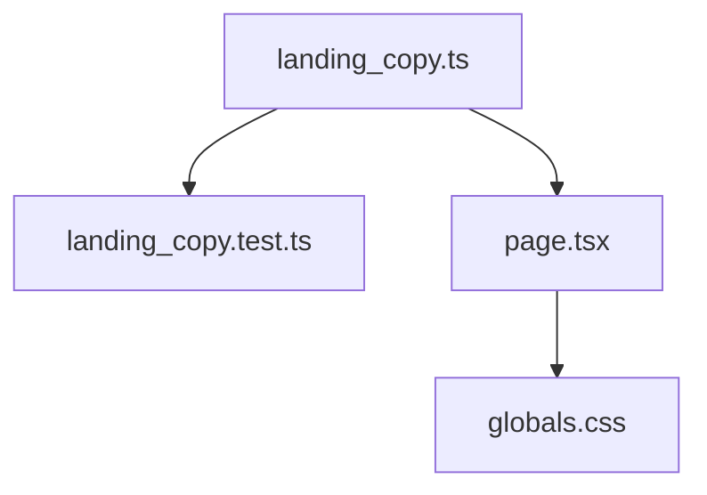

# Site Audit Activation Implementation Plan

> **For agentic workers:** REQUIRED SUB-SKILL: Use `superpowers:subagent-driven-development` (recommended) or `superpowers:executing-plans` to implement this plan task-by-task. Steps use checkbox (`- [ ]`) syntax for tracking.

**Goal:** Recompose `apps/site` first viewport and below-fold sections per S1, remove anti-slop tells (eyebrow, triad cards, em-dashes, infinite glow), and keep Start free / Sign in activation labels aligned with the app.

**Architecture:** Keep the static-export Next.js shell and CSS-variable system in `globals.css`. Extract landing copy into a small module so node:test can assert zero em-dashes and a single signup CTA label. Restructure `page.tsx` markup + CSS composition without adding Tailwind or a component library.

**Tech Stack:** Next.js 15 App Router (`apps/site`), hand-rolled CSS, `node:test`, Biome/pnpm workspace scripts.

## Global Constraints

- Brand lock: dark `#050505` + orange `#f54e00`; Fraunces + Outfit; no light theme.
- CTA labels: **Start free** = signup; **Sign in** = login. No other signup-intent synonyms on the landing page.
- Zero em-dash (`—`) or en-dash (`–`) characters in any user-visible string on the site.
- No three equal bordered cards for Grant/Propose/Review.
- No hero eyebrow; hero is brand + one headline + one short lede + primary CTA (+ secondary Sign in as text/outline).
- Deep links stay `/signup` and `/login` on `APP_ORIGIN` (no new onboarding query protocol).
- Preserve `prefers-reduced-motion` (no rise/glow; video → poster).
- Spec: `docs/superpowers/specs/2026-09-08-site-audit-activation-design.md`.

## File map

| File | Responsibility |
|------|----------------|
| `apps/site/src/lib/landing-copy.ts` | **New** — all landing strings + CTA labels |
| `apps/site/src/lib/landing-copy.test.ts` | **New** — em-dash + CTA intent tests |
| `apps/site/src/app/page.tsx` | Hero + band markup using landing-copy |
| `apps/site/src/app/globals.css` | Hero full-bleed composition; kill triad cards / k-glow |
| `apps/site/src/app/layout.tsx` | Header/footer copy without em-dashes; secondary CTA style |
| `apps/site/src/lib/site-metadata.ts` | Titles/descriptions without em-dashes |
| `apps/site/public/favicon.svg` | Retint to black+orange if still warm palette |
| `apps/site/public/404.html` | Retint to brand tokens |



---

### Task 1: Landing copy module + em-dash / CTA tests

**Files:**
- Create: `apps/site/src/lib/landing-copy.ts`
- Create: `apps/site/src/lib/landing-copy.test.ts`
- Test: `apps/site/src/lib/landing-copy.test.ts`

**Interfaces:**
- Produces: `LANDING` object with `hero`, `trust`, `problem`, `place`, `how`, `forWhom`, `join`, `ctaPrimary`, `ctaSecondary` string fields (exact keys below).

- [ ] **Step 1: Write the failing test**

```ts
import assert from 'node:assert/strict';
import { describe, it } from 'node:test';
import { LANDING, visibleLandingStrings } from './landing-copy.ts';

describe('landing copy', () => {
  it('has zero em-dash or en-dash characters', () => {
    for (const value of visibleLandingStrings()) {
      assert.equal(/\u2014|\u2013/.test(value), false, value);
    }
  });

  it('uses Start free as the only signup CTA label', () => {
    assert.equal(LANDING.ctaPrimary, 'Start free');
    assert.equal(LANDING.ctaSecondary, 'Sign in');
    assert.equal(LANDING.joinPrimary, 'Start free');
  });

  it('has no hero eyebrow field', () => {
    assert.equal('eyebrow' in LANDING.hero, false);
  });
});
```

- [ ] **Step 2: Run test to verify it fails**

Run: `cd /workspace && pnpm exec node --test apps/site/src/lib/landing-copy.test.ts`  
Expected: FAIL (module missing)

- [ ] **Step 3: Write minimal `landing-copy.ts`**

```ts
export const LANDING = {
  ctaPrimary: 'Start free',
  ctaSecondary: 'Sign in',
  joinPrimary: 'Start free',
  hero: {
    heading: 'Let agents write your records without losing control.',
    lede: 'One shared workspace for people and agents, with field-level grants and review before anything lands.',
  },
  trust:
    'Built by Ciel. Same data plane for people and agents: grants, proposals, and history in one console.',
  problem: {
    heading: 'Agents need to write. Your database was not built for that.',
    body: 'Most stacks assume writes come from reviewed application code. Give an agent production access and you risk silent corruption. Keep it read-only and you leave most of the value on the table.',
  },
  place: {
    heading: 'One workspace. Equal principals. Review before it sticks.',
    body: 'KitsuneOS puts authorization and review in the data plane. Humans and agents share grants, history, and the same collections. Agents propose by default; operators approve in Changes beside the tables they already use.',
  },
  how: {
    heading: 'Grant, propose, review',
    steps: [
      {
        title: 'Grant',
        body: 'Scope an agent to the collections and fields it may touch, down to the row when you need it.',
      },
      {
        title: 'Propose',
        body: 'Agent writes arrive as reviewable change sets, not silent updates to production rows.',
      },
      {
        title: 'Review',
        body: 'Approve or reject in Changes before anything sticks. Humans keep control.',
      },
    ],
  },
  forWhom: {
    heading: 'For teams wiring agents to real records',
    body: 'Founders, operators, and developers who need agents on production data without a second system of record.',
  },
  join: {
    heading: 'Start free',
    body: 'Free plan for getting a workspace running. Upgrade to Pro when you need more agents, people, and capacity.',
  },
} as const;

export function visibleLandingStrings(): string[] {
  const out: string[] = [
    LANDING.ctaPrimary,
    LANDING.ctaSecondary,
    LANDING.joinPrimary,
    LANDING.hero.heading,
    LANDING.hero.lede,
    LANDING.trust,
    LANDING.problem.heading,
    LANDING.problem.body,
    LANDING.place.heading,
    LANDING.place.body,
    LANDING.how.heading,
    LANDING.forWhom.heading,
    LANDING.forWhom.body,
    LANDING.join.heading,
    LANDING.join.body,
  ];
  for (const step of LANDING.how.steps) {
    out.push(step.title, step.body);
  }
  return out;
}
```

Note: Fix "Inbox" → "Changes" in place copy (product truth). Keep claims within PRD.

- [ ] **Step 4: Run tests and make sure they pass**

Run: `cd /workspace && pnpm exec node --test apps/site/src/lib/landing-copy.test.ts`  
Expected: PASS

- [ ] **Step 5: Commit**

```bash
git add apps/site/src/lib/landing-copy.ts apps/site/src/lib/landing-copy.test.ts
git commit -m "test(site): landing copy module with em-dash and CTA guards"
```

---

### Task 2: Recompose hero + how band in page.tsx

**Files:**
- Modify: `apps/site/src/app/page.tsx`
- Modify: `apps/site/src/app/globals.css`

**Interfaces:**
- Consumes: `LANDING`, `signUpUrl`, `signInUrl` from `@/lib/landing-copy` and `@/lib/urls`

- [ ] **Step 1: Rewrite `page.tsx` structure**

Replace the hero to use `LANDING` (no eyebrow). Structure:

```tsx
import { LANDING } from '@/lib/landing-copy';
import { contactMailto, signInUrl, signUpUrl } from '@/lib/urls';

export default function LandingPage() {
  return (
    <main>
      <section className="hero" aria-labelledby="hero-heading">
        <div className="hero-stage" aria-hidden="true">
          <video className="hero-video" /* same attrs as today */>
            <source src="/kitsune-agents-ad.mp4" type="video/mp4" />
          </video>
        </div>
        <div className="hero-copy">
          <p className="hero-brand">
            Kitsune<span className="hero-brand-os">OS</span>
          </p>
          <h1 id="hero-heading">{LANDING.hero.heading}</h1>
          <p className="hero-lede">{LANDING.hero.lede}</p>
          <div className="hero-actions">
            <a className="cta cta-primary" href={signUpUrl}>
              {LANDING.ctaPrimary}
            </a>
            <a className="cta cta-text" href={signInUrl}>
              {LANDING.ctaSecondary}
            </a>
          </div>
        </div>
      </section>
      {/* trust / problem / place / how as narrative strip not .triad cards / for / join */}
    </main>
  );
}
```

How band: single `ol.how-steps` with three `li` items (Grant / Propose / Review) — **not** `.triad article` cards.

- [ ] **Step 2: Update `globals.css` composition**

Required CSS outcomes:
1. `.hero` is `min-height: 100dvh` (not `h-screen`), relative; `.hero-stage` absolute inset-0 full-bleed video with dark scrim.
2. Delete or unused: `.hero-eyebrow`, `.triad`, `.band-triad article` card chrome, `@keyframes k-glow`, `.hero-media` inset card treatment.
3. Add `.how-steps` as a vertical or single-column list with hairline separators (no bordered elevated cards, no hover lift).
4. `.cta-text` is text/link style (not twin pill). Keep `.cta-primary` filled orange pill or slightly less-pill if desired; primary stays high contrast `#140700` on `#f54e00`.
5. Under `@media (prefers-reduced-motion: reduce)`: disable `k-rise` / any entrance; hide video; show poster as background on `.hero-stage`.

- [ ] **Step 3: Build the site**

Run: `cd /workspace && pnpm --filter @kitsuneos/site build`  
Expected: success, static export ok

- [ ] **Step 4: Commit**

```bash
git add apps/site/src/app/page.tsx apps/site/src/app/globals.css
git commit -m "feat(site): full-bleed hero and narrative how-steps"
```

---

### Task 3: Layout, metadata, brand chrome

**Files:**
- Modify: `apps/site/src/app/layout.tsx`
- Modify: `apps/site/src/lib/site-metadata.ts`
- Modify: `apps/site/public/favicon.svg`
- Modify: `apps/site/public/404.html` (if warm palette remains)

- [ ] **Step 1: Strip em-dashes from layout + metadata**

Header CTAs: Start free / Sign in only. Footer legal links unchanged. Metadata titles/descriptions must pass the same `\u2014|\u2013` ban (add those strings to `visibleLandingStrings()` or a second `SITE_CHROME_STRINGS` array tested in `landing-copy.test.ts`).

- [ ] **Step 2: Retint favicon/404**

Replace warm stone/gold fills with `#050505` / `#f54e00` / `#f5f5f5`. Do not change icon geometry unless broken.

- [ ] **Step 3: Re-run copy tests + site build**

Run:
```bash
pnpm exec node --test apps/site/src/lib/landing-copy.test.ts
pnpm --filter @kitsuneos/site build
```
Expected: PASS / success

- [ ] **Step 4: Manual check**

Open built site or `pnpm --filter @kitsuneos/site dev`:
- First viewport: brand visible, no eyebrow, CTA without scroll on desktop
- No three-card how section
- Grep built HTML for `—` → zero hits in text nodes

- [ ] **Step 5: Commit**

```bash
git add apps/site/src/app/layout.tsx apps/site/src/lib/site-metadata.ts apps/site/public/favicon.svg apps/site/public/404.html apps/site/src/lib/landing-copy.ts apps/site/src/lib/landing-copy.test.ts
git commit -m "fix(site): chrome copy and brand-aligned favicon"
```

---

### Task 4: Verify against S1 success criteria

- [ ] **Step 1: Checklist**

- [ ] Brand wordmark hero-level  
- [ ] One primary CTA label site-wide for signup  
- [ ] Zero em-dashes  
- [ ] No Grant/Propose/Review card triad  
- [ ] No infinite `k-glow`  
- [ ] Reduced-motion path intact  
- [ ] `signUpUrl` / `signInUrl` unchanged hosts/paths  

- [ ] **Step 2: Final commit if docs need a one-line status note**

Optional: add `Status: Implemented` note at top of S1 spec only if the team wants living status; otherwise leave specs historical and skip.

---

## Spec coverage (self-review)

| Spec section | Task |
|--------------|------|
| Hero recomposition | Task 2 |
| Kill triad cards | Task 2 |
| Em-dash ban | Tasks 1, 3 |
| Motion / reduced-motion | Task 2 |
| Activation labels + deep link default | Tasks 1–2 (urls unchanged) |
| Favicon/404 retint | Task 3 |
